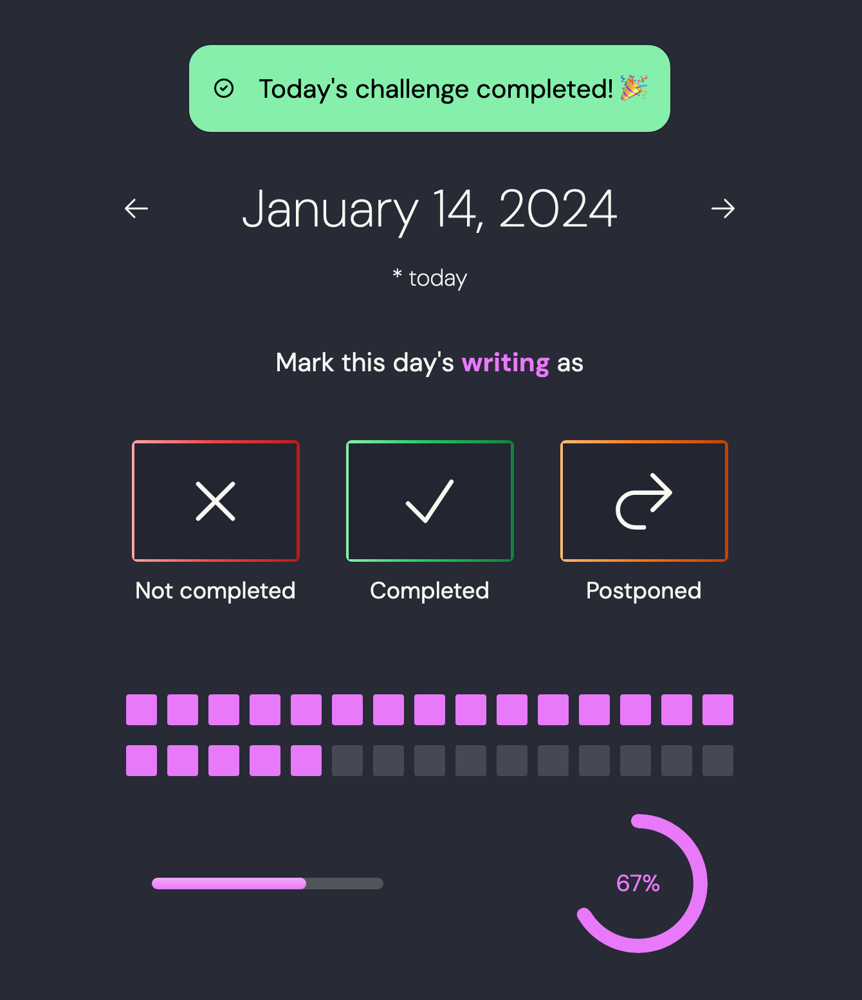
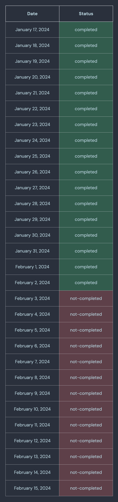

Lemon is a simple local "habit tracker" for [30-day challenges](https://www.verywellmind.com/do-thirty-day-challenges-work-4164524), created for personal use (_and mostly to tinker with [Server Actions](https://nextjs.org/docs/app/building-your-application/data-fetching/server-actions-and-mutations)!_).

You can color-code each challenge, mark its status daily, and watch your progress.

<!-- lemon-homepage-demo -->

### Usage

Clone the repository:

```
git clone git@github.com:rivea0/lemon.git
```

`cd` into it:

```
cd lemon
```

Install dependencies:

```
npm install
```

Initialize the SQLite3 database (this will create a `challenges.db` file inside `src/app/db`, see [schema](#db-schema)):

```
cd src/app/db
node initializeDb.js
```

Run the server:

```
npm run dev
```

### Features
##### Adding a challenge

You can add a new challenge by going to the `/add-challenge` route, providing a title and choosing a color for the challenge (it defaults to yellow if you don't pick any). You can also provide a description, which is shown on the homepage underneath the challenge title, and you can also select a starting date of your own choosing. It defaults to today's date if you don't specifically provide one.

<!-- lemon-add-demo -->

##### Homepage

On the homepage, you can see all your challenges and "tracker grids" for each challenge, which makes it easier to see your progress visually. You can also see challenges yet to be completed for that day, so it's easier to see them at a glance.

##### Challenge page

Each challenge has its own specific route. For example, if the title of the challenge is "push-ups," then the `/push-ups` route has everything specific to that challenge. (You can go to a challenge's page by clicking on it from the carousel on the homepage.) You can choose a date to change its status: not-completed, completed, or postponed. The page also has progress indicators: a tracker grid that is colored for each day with the identity color of the challenge if it's completed, a progress bar, and a radial progress showing the percentage for the completed days. 



There is also a table showing the status of the challenge for each day, for example:



##### Removing a challenge

Each challenge page has a "remove this challenge" button at the bottom, so you can easily mark it as removed. To delete a challenge permanently, you can go to the `/removed-challenges` route by selecting it from the menu and clicking the "delete this challenge permanently" button.

##### Completed challenges

You can select the completed challenges from the menu to see all your completed challenges. Each one also has a "delete this challenge permanently" button if you wish to completely delete it from the database.

<!-- lemon-completed-challenges -->

<h5 id="export-data">Exporting your data</h5>

You can choose the "export your data" option from the menu, which downloads an `out.zip` file that includes two JSON files: `challenges.json`, and `dates-entries.json`.

challenges.json includes the fields:
- `id`
- `title`
- `id_color`
- `description`
- `start_date`
- `deleted` (`0` if marked as deleted, `1` otherwise)

dates-entries.json includes the fields:
- `date`
- `challengeId`
- `status`

##### Inspiration

This project was started initially to track progress for [DAREBEE Workout Challenges](https://darebee.com/challenges). You can go to the `/inspiration` route by selecting the "inspiration" option from the menu to see some examples.

#### Themes


You can select one of the themes:
- Light
- Dark
- Dim
- Lemonade
- Dracula
- Synthwave
- Nord
- Autumn

<!-- lemon-theme-switch -->

You can extend the themes by choosing one from [DaisyUI themes](https://daisyui.com/docs/themes/), modifying `tailwind.config.ts` like so:

```ts
module.exports = {
  //...
  daisyui: {
    themes: ['light', 'dark', ..., 'cupcake'],
  },
}
```

And adding the new theme to `src/app/components/ThemeSwitcher.tsx`:

```tsx
<li>
  <input
    type="radio"
    name="theme-dropdown"
    className="theme-controller btn btn-sm btn-block justify-start"
    aria-label="Cupcake"
    value="cupcake"
    onChange={() => setTheme('cupcake')}
  />
</li>
```

<h4 id="db-schema"><code>challenges.db</code> schema</h4>

When you initialize the database, two tables are created: `challenges` and `dates_entries`.
The schema is almost the same with JSON fields for the files created when you [export your data](#export-data).

`challenges` table includes:
- `id`,
- `title`,
- `id_color`,
- `description`,
- `start_date`,
- `deleted` (either `0` or `1`, defaults to `0`)

`dates_entries` table includes:
- `date`
- `challengeId`
- `status`

`challengeId` being a foreign key, referencing `challenges(id)`.

### License
GPLv3
